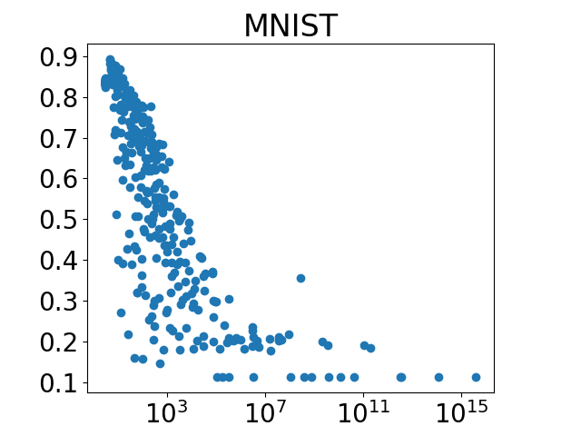
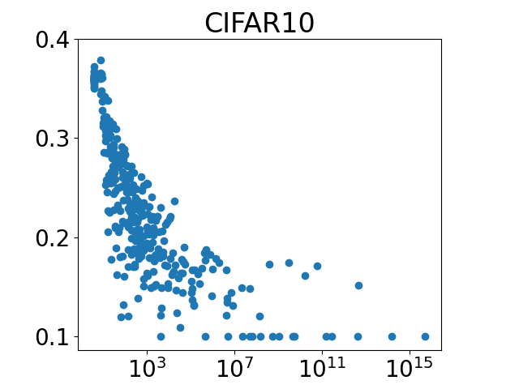
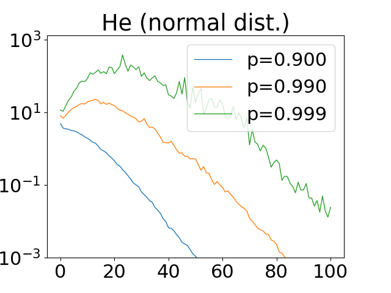
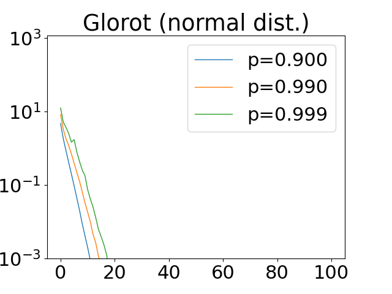
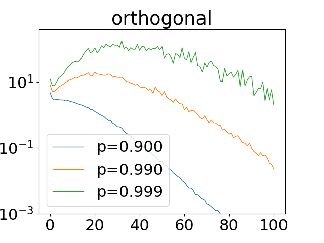
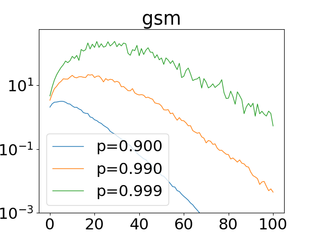
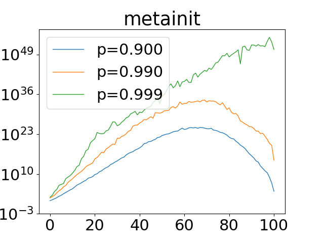
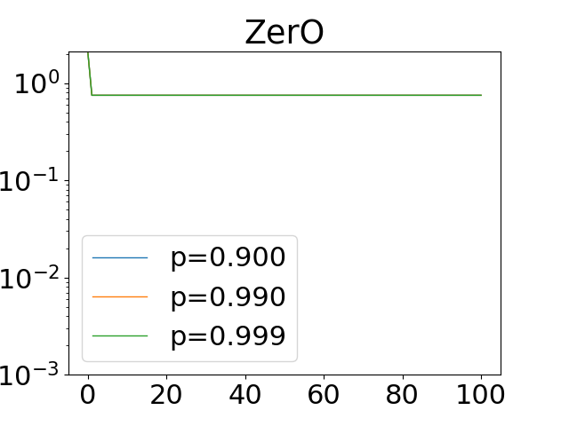
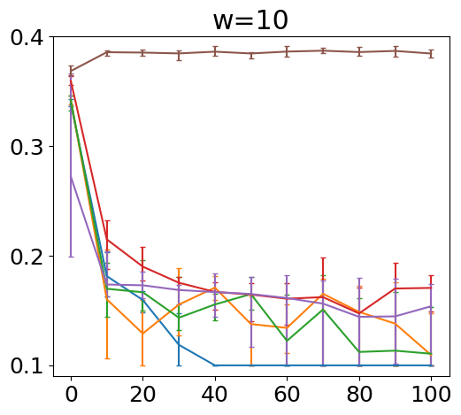
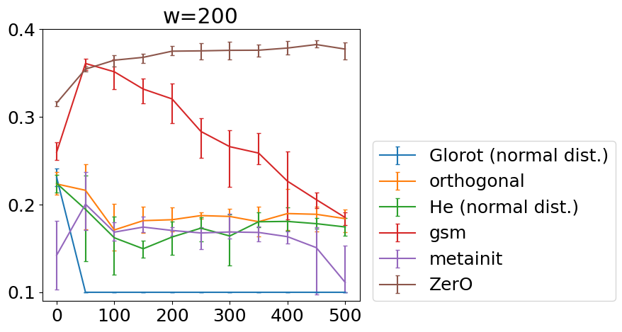

This is Python code to reproduce the results from the paper *The Vanishing Empirical Variance
in Randomly Initialized Deep ReLU Networks*.

### Environment

The experiments were run on a laptop with Ubuntu 20.04 OS. Python version was 3.7.16. The external libraries used in the
code can be installed by running
```
pip install -r requirements.txt
```

### Reproduction: paper
Figure 1 can be reproduced by running
```
python -m figure_1_3 --max-depth 50 --depth-step 5 --network-widths 5 10 15 20 25 30 35 40 45 50 --num-repeats 1 \
    --dataset MNIST --num-gradient-steps 500 --initializers he_bernoulli he_uniform he_normal --normalization-layers no_norm
python -m figure_1_3 --max-depth 50 --depth-step 5 --network-widths 5 10 15 20 25 30 35 40 45 50 --num-repeats 1 \
    --dataset CIFAR10 --num-gradient-steps 500 --initializers he_bernoulli he_uniform he_normal --normalization-layers no_norm
```




Figure 2 can be reproduced by running
```
python -m figure_2 --depth 100 --width 10 --num-repeats 10000 --dataset CIFAR10 --initializers he_normal glorot_normal \
    orthogonal gsm metainit_cifar10_from_he_normal ZerO
```







Figure 3 can be reproduced by running
```
python -m figure_1_3 --max-depth 100 --depth-step 10 --network-widths 10 --num-repeats 5 --dataset CIFAR10 \
    --num-gradient-steps 500 --initializers he_normal glorot_normal orthogonal gsm metainit_cifar10_from_he_normal ZerO \
    --normalization-layers no_norm --learning-rate 1e-4
python -m figure_1_3 --max-depth 500 --depth-step 50 --network-widths 200 --num-repeats 5 --dataset CIFAR10 \
    --num-gradient-steps 500 --initializers he_normal glorot_normal orthogonal gsm metainit_cifar10_from_he_normal ZerO \
    --normalization-layers no_norm --learning-rate 1e-5
```



